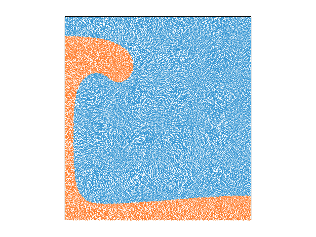

<table><tr><td></td><td></td></tr>
  <tr><td></td><td></td></tr></table>

About
-----
**_Please replace the following with information about your own repository._**

Welcome! This is a template git repository for creating REPRODUCIBLE Underworld code based projects.

REPRODUCIBLE because this project:
1. Is stored in a git repository.
2. Uses a Dockerfile to recreate the exact project environment.

The two features above enable the project to take advantage of software engineering and open source principles, such as:
_version control_, _reproducible environments_, _collaboration_ (Pull Requests, Binderhub), _continuous integration_. 

(See https://the-turing-way.netlify.com/, for a general introduction to these principle. N.B. it is data-science focussed)  

You can use this repository as a GitHub template to start a new repository of your own that matches the requirements of the underworld-community. To get started, hit the "Use this template" button above. See this [quick start guide]( https://github.com/underworld-community/template-project/wiki/Quick-start) for more information.

Files
-----
**_Please give a quick overview of purpose of the model files/directories included in this repo._**
**_Note that while light data files are fine,  heavy data should not be included in your repository._**

File | Purpose
--- | ---
`01_Steady_State_Heat.ipynb` | A simple steady state heat (Laplacian equation) solve.
`02_Convection_Example.ipynb` | An example of thermomechanical convection.
`03_BlankenbachBenchmark.ipynb` | A thermochemical convection benchmark model.
`04_StokesSinker.ipynb` | A 2D stokes sinker.
`05_Rayleigh_Taylor.ipynb` | The Rayleigh Taylor Benchmark model.
`06_SlabSubduction.ipynb` | A 2D Slab subduction model, mechanical only.
`07_ShearBandsPureShear.ipynb` | Model shear bands under pure shear.
`08_Uplift_TractionBCs.ipynb` | An example of a traction boundary condition to drive topography.
`09_Groundwater_Flow.ipynb` | A 2D Darcy flow Benchmark model, tested against an analytic solution.
`10_Analytic Solutions.ipynb` | A series of analytical tests for Stokes flow problems, used to test error convergence rates.
`11_ViscoelasticityInSimpleShear.ipynb` | An example of Viscoelastic Shear in 2D, compared against an analytic solution.
`images` | Directory of images.
`RTI_GrowthRate_Supp` | Information on the full RayTay model run.
`input` | Input information for various models.

Tests
-----
All models are tested against some result. See each model for specific details.

Parallel Safe
-------------
**_Please specify if your model will operate in parallel, and any caveats._**

Yes all models are parallel safe. Errors can occur if resolution is too low for parallel decomposition.

Check-list
----------
- [x] (Required) Have you replaced the above sections with your own content? 
- [x] (Required) Have you updated the Dockerfile to point to your required UW/UWG version? 
- [x] (Required) Have you included a working Binder badge/link so people can easily run your model?
                 You probably only need to replace `template-project` with your repo name. 
- [x] (Optional) Have you included an appropriate image for your model? 
